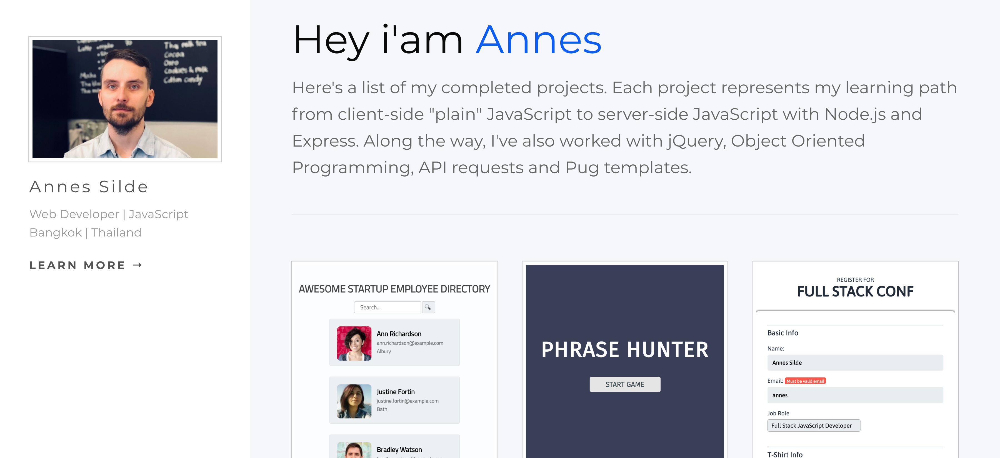

# Static NodeJS and Express Site

> Portfolio site made with Node.js, Express and Pug, setting up a server, handling requests, working with server-side JavaScript, and building a powerful and modern back end project.

## Features

* JSON file to store all the data about the projects I've created so far
* Pug templates & JSON to generate the markup that is ultimately displayed in the browser
* Routes to handle requests
* Middleware to utilize static files
* Error handling
* Server to serve the project

## To start server locally

* Run `npm install`

* Then `npm start`

Open [http://localhost:3000](http://localhost:3000) to view it in the browser

## Technologies

* JavaScript
* Node.js
* Express
* Pug
* CSS
* HTML

## Demo

Active demo: [Static NodeJS and Express Site](https://p6-test.herokuapp.com/)

## Screenshot

## Status

Project is: _completed_

## Inspiration

Treehouse Techdegree: FSJS project 6 - Static NodeJS and Express Site

## CSS style changes

* body background to rgb(245, 247, 250) & font-family: 'Montserrat', sans-serif;
* a:hover color: #111 to rgb(12, 93, 242);
* button background-color: #333 to rgb(12, 93, 242) + border-radius: 8px;
* a color: #333 to rgb(12, 93, 242)
* added favicon icon

## Contact

Created by [@Annes](https://twitter.com/annesCode)
